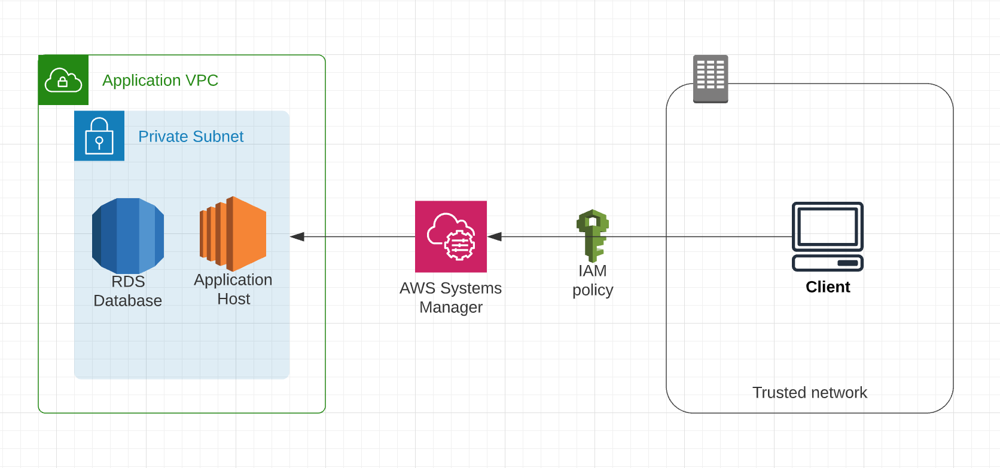

# Systems Manager For Private Networks Demo.

This is an example application to accompany this blog post: [Using AWS Systems Manager vs Bastion Hosts](https://medium.com/canisworks/aws-systems-manager-vs-bastion-hosts-for-private-networks-efe9a42f5ad7).

Demonstrates how to control access to private services using Systems Manager.

## CDK Stack:
 * RDS database instance.
 * EC2 Amazon Linux instance.
 * Application VPC with private subnet.
 * IAM access polices.

 

## Useful commands for CDK: 

 * `npm run build`   compile typescript to js
 * `npm run watch`   watch for changes and compile
 * `npm run test`    perform the jest unit tests
 * `cdk deploy`      deploy this stack to your default AWS account/region
 * `cdk diff`        compare deployed stack with current state
 * `cdk synth`       emits the synthesized CloudFormation template
