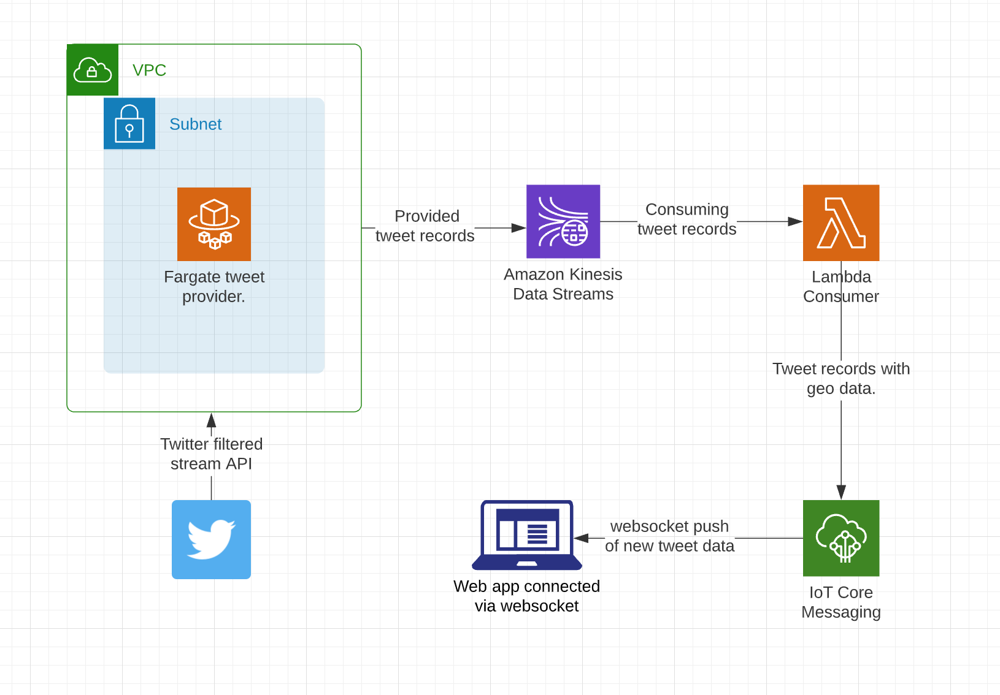

# Twitter Streaming via Kinesis.

This is an example application to accompany this blog post: [How Fast is AWS Kinesis](https://medium.com/canisworks).

Demonstrates how to receive tweets from Twitter's streaming API, push them to Kinesis, then finally consume them in a web app (via iot mqtt websocket).

 ## !! WARNING !! ##
 Do not leave this Demo stack running, it will use up AWS account resources and cost you money! (ECS, Kinesis, Lambda invokes, NATs, etc).

## CDK Stack:
 * Fargate ECS cluster (tweet provider).
 * Kinesis single shard data stream.
 * Lambda Kinesis consumer.
 * Cognito Identity Pool with IOT pub/sub permissions.
 * VPC with Public / Private subnets (ECS outbound access only).

 

