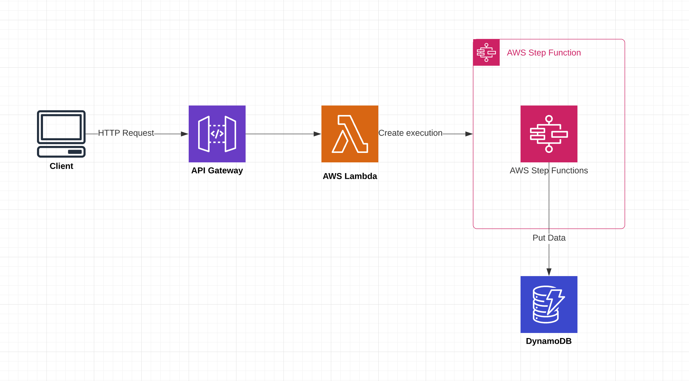

# Monitoring Distributed Applications Demo.

This is an example application to accompany this blog post: [Monitoring Distributed AWS Applications](https://medium.com/canisworks/monitoring-distributed-aws-applications-ffe534c10124).

Demonstrates how to use X-Ray to trace requests through a distributed application.

## CDK Stack:
 * Api Gateway (REST API)
 * NodeJS Lambdas
 * Step Functions
 * DynamoDB

 

## Useful commands for CDK: 

 * `npm run build`   compile typescript to js
 * `npm run watch`   watch for changes and compile
 * `npm run test`    perform the jest unit tests
 * `cdk deploy`      deploy this stack to your default AWS account/region
 * `cdk diff`        compare deployed stack with current state
 * `cdk synth`       emits the synthesized CloudFormation template
